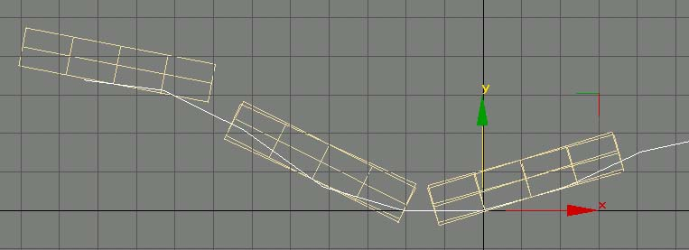

## Introduction

The Distributor is a system for the creation, maintenance, and processing of
complex aggregates. The power of the Distributor is in things that aren’t
important as individual objects, but only as a collection. The Distributor
offers several benefits.

* It allows you to work at a higher level of abstraction. If you want to make a
  forest, you can work on it as a forest, rather than as 100 trees.
* It automatically does many things that you would do, but wouldn’t enjoy doing.
  It attempts to take on as much of the grunt work as possible, freeing you to
  concentrate on the art work.
* It makes for assets more robust in the face of change. Major restructuring of
  the underlying terrain will generally require no reworking of the ground cover
  under control of the Distributor system.
* It allows for higher optimizations in the rendering. Because the system as a
  whole has more information about what is being attempted and how it is
  constructed, it can perform optimizations that couldn’t be applied to generic
  scene geometry.
* It insulates the assets from changes in system requirements. The generated
  geometry is currently generated offline and exported as normal scene data. But
  on a different platform (e.g. Xbox), or over a slow bandwidth network, it
  would probably prove more efficient to generate the data at runtime on the
  client machine. The Distributor allows technical restructuring as needed
  without having to rework assets.

### Terms

* Cluster – the master component, runs the Distributors
* Distributor – actually distributes replicant geometry over scene surfaces
  according to user parameters.
* Replicant – an individual mesh to be replicated and distributed over one or
  more surfaces.
* Surface – the mesh or meshes over which you will be distributing replicants.

### General Tips

* Limit the number of materials you use, preferably to one per distributor. Tile
  your plant bitmaps into a single texture, and use your UV mapping to select
  which plant each replicant gets.
* Don’t hand edit the output of the Cluster. Adjust with the Distributor
  parameters. Any hand editing of the output will be lost the next time the
  scene is generated.
* Reuse your Fade Out (and Fade In) parameters. Setting one distributor to fade
  out at 60 feet and another to fade out at 65 feet will not give much of a
  perceptual difference, but it will prevent the system from batching the output
  of the two Distributors together.
* No you can't use View Facing on distributed objects as the cost would be
  prohibitive. The system will ignore you if you try.
* No you can't add shadows to distributed objects yet…maybe later.
* You can use as many distribution probability maps as you need. Different
  distributors can use specific maps or share maps with other distributors
  depending on what replicants you want where.
* The wind can't move mesh distributions in waves. You can randomize the motions
  somewhat with the flexibility component and by making secondary distributions
  attached to secondary child Wind Bones with different values.
* When using 'Surf Offset Min/Max' \[Conformity to Surface\] to make floating
  objects, remember that the distributor will be filling a volume rather than
  covering a surface. You can fit \*many\* more objects into a volume than on a
  surface with any given set of density and spacing values.

### Getting Started

The most basic usage is straightforward and simple. Start off just seeing your
replicants getting spread about, and then work into more control with the
various parameters.

To start, you will need at least one surface (e.g. the terrain mesh(s)) over
which you want to distribute stuff.

Second, you will need at least one object to distribute.

Once you have these two Max objects, you need at least two components.

For each distinct distribution of replicants, you need a Distributor Component.
The Distributor Component is attached to the mesh or meshes over which you will
be distributing replicants (the Surface). One Distributor can distribute any
number of replicants, but they will all be distributed with the same pattern.
One surface may have any number of distributions, and hence Distributors, over
it. Surfaces may also share Distributors, one Distributor may be applied to a
group of surface meshes, and the distribution will logically span all those
surfaces.

The second component is the Cluster Component. The Cluster Component manages the
multiple Distributors, and optimizes the output. It should be attached to all
the meshes which have Distributors it will manage.

Apply the Distributor and the Cluster Component to your surface mesh(s). Select
the Distributor in the Component Util. Go to the Replicant Objects rollup (the
first one and only one open). Click on Add. Now select your replicant object.
Okay, you’re ready to go. Select the Cluster Component in the Component Util.
Hit Go. The rest is just fine tuning the parameters, as described below.

If you are trying to adjust the **Distribution**, you want one of these rollups:  
**Spacing**  
**Orientation Dependence**  
**Altitude Dependence**  
**Probability Bitmap**

If you are trying to adjust **Appearance**, you want one of these rollups:  
**Replicants**  
**Scaling**  
**Replicant Orientation**  
**Conformity to Surface**  
**LOD Fade**  
**Wind Effect**

## Distributor Roll outs – Attach to Base Surface Mesh

### Replicants

The list of objects you want distributed over the surface. To add to the list,
click on the Add button, then select the object you want to replicate, either by
mouse picking in the scene or through select by name. To remove an object from
the list, click on the object’s name in the list box, and click the Remove
button.

A Distributor can have any number of objects to replicate. For each position it
decides to drop a replicant into the scene, it will randomly select one
replicant from the list. Adding an object into the list twice will double its
chances of getting picked, and therefore double its frequency of occurrence in
the scene. For example, if the replicant list consists of ObjectA once, and
ObjectB four times, the output will be a mix consisting of 1/5 ObjectA and 4/5
ObjectB.

All replicants within a Distributor should share the same material. The Scale of
all replicant’s transforms should be reset before adding them to a distributor.
The orientation of the replicant can optionally affect its placement in the
world. See Replicant Orientation below.

The placement of the pivot point on the replicants is key. The pivot point
should be at the ground level of the replicant (the base), with the Z axis
pointing toward the end protruding out of the surface.

### Spacing

#### Spacing

The nominal spacing between replicants distributed over the surface. In feet.

#### Density

The overall probability that a spot on the spacing grid will receive a
replicant. A lower density reduces the number of replicants, a higher density
will produce a more even coverage. In Percent.

So if Density is 100.0 you get as many replicants as will fit Spacing ft apart.
If you set Density to 0 you get no replicants (don’t do that).

#### Randomness

Amount to randomly perturb the replicant positions from a hypothetical grid. A
randomness of 0% will put the replicants on a somewhat regular grid (with
distance between grid points of Spacing), a randomness of 100% will produce a
totally random coverage.

#### Separation

Amount to prevent interpenetration between replicants. In abstract, the system
will place a protected zone around each replicant. The system won’t place the
replicant anywhere that would make its protected zone intersect any other
protected zone. Once the replicant is placed in the scene, no other replicant
will be added in a way that would make its protected zone intersect the first’s.
The options relate to the size of the protected zone, and are:

**None** – Allow replicants to be placed directly on each other.  
**Low** – Create a one foot cube protected zone around each replicant.  
**Medium** – Protected zone is the replicant’s bounding box.  
**High** – Protected zone is a box of size Spacing cubed.

#### Tip on Spacing

You can decrease the number of replicants distributed over your surface either
by increasing the Spacing or decreasing the Density. Note that the distribution
process will go faster if you increase the Spacing versus decreasing the
Density. Try to use the Spacing first to get about the right density, and then
tweak with the Density setting.

### Scaling

#### Scale Range Min/Max

Amount to randomly scale replicants as they are added to the scene. You may
supply a minimum and a maximum amount to scale in each dimension. The system
will pick a random scale amount in that range for each replicant. The dimensions
are in the replicant’s native space based on its pivot point. A scale value of
2.0 will double the size of the replicant.

#### Lock

By default, this is a non-uniform scale. For example, if you have minimum and
maximum scales of 1.0 and 2.0 respectively for all three dimensions, the system
might select a scale of 1.0 in X, 1.5 in Y and 2.0 in Z.

There may be times that this isn’t what you want. There are two check boxes to
lock dimensions of the scale (on the right). The first check box locks the X
and Y scaling. So from top down, replicants will remain constant in their
proportions, but their height will vary independently. When the XY lock is
selected, the Y scale values will be greyed out and ignored, as X and Y will
both be scaled by the same amount, as determined from the X scale range.

The second scale lock check box will tie all three scale dimension. When
selected, the Y and Z scale ranges will be greyed out and ignored, as X, Y, and
Z will be scaled by the amount determined from the X scale range. When selected,
replicants will vary in size, but remain constant in their proportions in all
three dimensions.

### Replicant Orientation

Control over the orientation of replicants distributed over the surface.

#### Align to Surface

Amount to base the “up” direction of the replicant on the surface normal at the
position the replicant is being placed, versus the “up” direction of the
original replicant object. (The “up” direction of the replicant is the direction
the Z (blue) axis of its pivot point points.) With a value of 100%, the “up”
direction of each replicant will point directly out of the surface. With a value
of 0%, the “up” direction of each replicant will be the same as the original. So
to make vines that hang straight down, turn your original vine upside down and
set Align to Surface to 0%.

Note that in no case will the system allow a replicant to poke down into the
surface over which it is being distributed. If you applied the hanging vines to
a surface which faces up, the vines will lay flat on the ground pointing down as
much as they can. Sometimes this is what you want, for other cases see the
Orientation Dependence section.

#### Normal Range deg

Amount in degrees to randomize the “up” direction. The up of the replicants in
the scene will fill a cone of this angle. This randomness is applied after the
check for meeting Orientation Dependence requirements (see Orientation
Dependence below).

#### Spin Range deg

Amount to randomize the spin of the object about its “up” direction. With a spin
range of zero, replicants will try to keep the Y axis of their pivot points
aligned with the source replicant’s. 180 degrees will apply a random spin to
each replicant placed in the scene.

#### Use Surface Face Normals Checkbox

Rather than interpolate the vertex normals to the position on the face at which
the replicant is being dropped, use the flat face normals. This has proven
useful for objects which mate with the surface over an extended area (e.g.
crater decals), particularly over rough surfaces. Note that this also affects
the Orientation Dependence described below.

### Orientation Dependence

Establishes a dependence on the surface normal of whether to place a replicant
at that position. The angles are based on the angle between the surface normal
and the UP direction. So 0 is up, 180 is down, 90 is in the XY plane.

Note that the angle is based on the surface normal, not the up direction of the
output replicant. So even if you force all your replicants to point straight up
(Align to Surface = 0), they will still fail the Orientation Dependence test if
the surface they are applied to fails.

Note also that the surface normal used IS affected by the Use Surface Face
Normals checkbox in Replicant Orientation (described above).

#### Start

Minimum angle from up to allow replicants.

#### End

Maximum angle from up to allow replicants

#### Transition

Number of degrees over which to transition from not allowing replicants to
allowing full coverage.

For example, say the Start angle is 45 degrees, the End angle is 90 degrees, and
the Transition is 5 degrees. Then where the surface normal is within 45 degrees
of pointing up there will be no replicants placed. At 45 degrees there will be
very few, ramping up to full coverage at 50 degrees (5 degree transition). There
will be full coverage from 50 degrees to 85 degrees. Coverage will ramp down
from 85 to 90 degrees. There will be no replicants where the surface normal is
more than 90 degrees from up (i.e. where the surface is vertical or at all
downward facing).

The angles 0 and 180 are treated slightly differently. If 0 or 180 is specified
as Start or End, then there is no transition to that angle, full coverage is
maintained all the way to straight up (0) or straight down (180). For example,
setting Start to 1, End to 90, and transition to 10 would cause no coverage
between 0 and 1 degrees from up, ramping up to full coverage at 11 degrees, full
coverage from 11 to 80 degrees, ramping down to no coverage at 90 degrees. But
setting Start to 0, End to 90 and transition to 10 would cause full coverage
from 0 to 80 degrees, ramping down to no coverage at 90 degrees.

Set Start and End to zero (0) to disable.

### Altitude Dependence

These are very analogous to the Orientation Dependence. Altitude Dependence can
be used, for example, to limit a type of fern to only appearing close to sea
level. Set Start and End to zero (0) to disable. All units are in feet in Max’s
world coordinates.

#### Start

The minimum height at which to allow replicants.

#### End

The maximum height at which to allow replicants.

#### Transition

The distance over which to transition from not allowing replicants to allow full
coverage.

### Conformity to Surface

#### Conform to surface (type)

Options on how to conform to underlying surface. The choices are:

**None** – Just make sure the pivot of the source replicant is on the surface.  
**Check** – Make sure all vertices are over the surface. Prevents extended
replicants from hanging over edges. See Max Adjust below.  
**All Verts** – Distort the replicant mesh copy so that each vertex keeps its
original height (relative to its pivot point) over the surface onto which it is
being distributed. See Max Adjust below.  
**Bottom** – Like All Verts option, but distorts based on height (relative to
pivot point). Verts at the base of the replicant conform exactly to the surface,
verts at the top of the replicant don’t conform at all, and verts in the middle
conform half way. See Max Adjust below.  
**Base** – Like Bottom option, but only vertices at the very base (within 6
inches) are adjusted. See Max Adjust below.

The following illustrate the different conform type behaviors.

  
**Conform None** – Note the box hanging off the left edge.

  
**Conform Check** – Same as None, but the boxes have shifted to avoid hanging
off the edge.

  
**Conform All Verts** – The entire boxes conform to the underlying surface.

  
**Conform Bottom** – Conformity to underlying surface decreases toward the top
of the boxes.

  
**Conform Base** – Only the base of the boxes conform to the surface.

#### Max Adjust (ft)

The maximum distance to allow the surface being distributed over to drop from
under a replicant or rise up into a replicant.

#### Surf Offset Min/Max

Specifies a range to offset replicants over the surface onto which they are
being distributed. For example, Offset Min and Max of  10.0 and 15.0
respectively would distribute the replicants in a layer five feet thick starting
ten feet off the ground.

### Probability Bitmap

The Probability Bitmap allows distributions to be hand painted onto a surface.
The bitmap won’t be exported, so it can be any size convenient. Unless you
already happen to have a convenient UV mapping, you should apply the mapping to
one of the upper channels which Plasma otherwise ignores.

#### Probability Texmap

The bitmap to use. You can drag and drop from the Material Editor here.

#### Channel

Which color or combination of colors from the bitmap to base the distribution
on. This allows the same bitmap to convey different distributions.

#### Remap

Allows remapping of bitmap values into distribution probabilities. For example,
to invert a bitmap distribution, leave From Lo and Hi at 0 and 255 respectively,
but swap To Lo and Hi to 255 and 0 respectively.

### LOD Fade

The Distributor generally distributes more polygons into your scene than you can
afford to render all the time. You can use the LOD Fade parameters to limit how
far away you can see your replicants, and how quickly they blend in. All
parameters are in feet.

#### Fade Out

Start/End – Replicants will be fully visible up to Start distance from the
camera, and then fade out gradually becoming fully invisible at End distance
from the camera. Set Start and End to zero to disable.

#### Fade In

Checkbox – Check this check box to enable the Fade In.

Start/End – Replicants will be fully invisible closer than Start distance from
the camera. They will gradually fade in becoming fully visible at End distance
from the camera.

### Wind Effect

The replicants distributed can optionally be affected by wind through hardware
skinning. The Wind Bone can either be a manually animated object or, preferably,
animated via the Wind Component described below. See also the Flexibility
Component description below for controlling the effect of the wind on individual
replicants.

#### Wind Bone Checkbox

Check this check box to enable selection of a wind bone. If unchecked, any
selected Wind Bone is ignored.

#### Wind Bone Select Box

Click on the select box and select the object to use as a Wind Bone by mouse
picking in the scene or through the select by name dialog.

### Randomization

#### Lock Randomization Checkbox

Once randomization is locked, the system will attempt to generate the same set
of replicants each time they are distributed. Keep in mind that changing the
distributor parameters or large changes to the underlying geometry will prevent
the same set of replicants from being generated.

#### Seed

The random number seed currently used.

### Actions

When setting up a specific Distributor, you can use the Preview function to get
a quick rough idea of what your current settings will generate. The output of
the Preview should be considered a rough draft and not exported. Keep in mind
that interactions between different Distributors (e.g. through the
Spacing/Separation) may cause somewhat different output than generated through
Preview.

#### Clear Preview

Clears anything generated from Preview.

#### Preview

Runs the Preview generation.

## Related Components

### Cluster – Attach to Base Surface Mesh

The Cluster Component runs the Distributors, collects their output, and
optimizes it. There can be only one Cluster Component on an object, but the same
Cluster Component can be on many surfaces. It is attached to the base mesh(s) of
the surface(s) over which you will be distributing replicants.

#### Optimization

Level controls how much optimization is performed. It should generally be left
at 100%.

#### Auto Export

The output of the Distributor system can be large and unwieldy. You generally
don’t want the output cluttering up your Max file and slowing things down. If
this box is checked, then at export the Cluster Component will check to see if
it has been cleared. If so, it will automatically run all its Distributors
before the export process and clear them back out again after the export is
done.

#### Clear

Clears all the distributed replicants generated by this Cluster Component out of
the Max File.

#### Go

Finds all Distributors attached to all Max objects this Cluster Component is
attached to, runs them, and optimizes the output. The optimized output will
appear as objects prefixed with the Cluster Components name, and be available as
a selection set of the same name as the generating Cluster Component.

### Wind Bone – Attach to Dummy Wind Representative

The Wind Bone Component applies a procedural wind effect to an object, making it
suitable for use as a Wind Bone in a Distributor. Wind Bones may be cascaded.
Typically, you would set up a hierarchy of bones, with Parents having more
Strength and Children having more flutter.

#### Strength

Overall strength of the wind effect, as a percentage from 0% to 100%.

#### Speed

The general rate of smooth oscillations, with lower values oscillating slower,
and higher values oscillating faster.

#### Flutter

Flutter or twitchiness of the wind. Higher values will put more flutter into the
wind.

#### Constancy

With a constancy of 0%, the wind will blow for a while, then completely die,
then blow some more. With a constancy of 100%, the wind will always be blowing
(although it will blow with varying amounts).

### Flexibility – Attach to Replicant

#### Flex %

The overall flexibility of this mesh. The Flexibility Component is typically
attached to the replicant meshes that a Distributor with a Wind Bone will be
distributing. A Flexibility Component currently has no effect without a Wind
Bone specified on the Distributor.

A flexibility of 100% will have the top of the mesh move in unison with its Wind
Bone, while the base of the mesh remains planted. This is generally more than
you want. Values are typically around 30%. A very small value will keep the mesh
from swaying at all, base and top remaining fixed.

A value of zero (0) is treated differently. For a flexibility of zero, the mesh
will no longer bend, but the base will no longer remain fixed. The entire mesh
will move as a unit with the Wind Bone. So to make a rigid plant, use a
flexibility of something like 1%.

#### Randomness within Mesh

This governs how much variation within a mesh there is in reaction to wind. With
a value of 0%, the replicant will bend uniformly with the wind. With a value of
100%, different parts of the replicant will bend different amounts.

#### Randomness between Meshes

The amount of variation in bend amount between different replicants. With a
value of 0% (and 0% Randomness within Mesh), all replicants will bend in
reaction to the wind in unison. With a value of 100%, each replicant will bend a
slightly different amount.

### X-Form Component – Attach to Replicant

The X-Form Component is attached to replicants to let the system know that
that’s what they are. This lets the system shade them differently, preventing
shading artifacts from giving away the trick. The X-Form Component currently has
no options.

  
**Typical X-Form**
